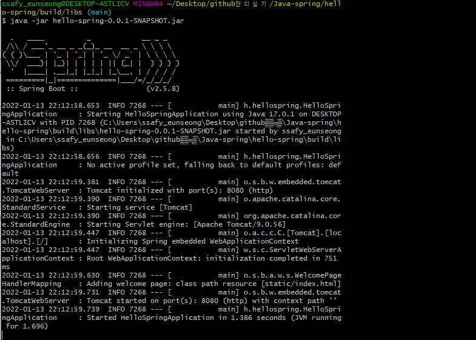
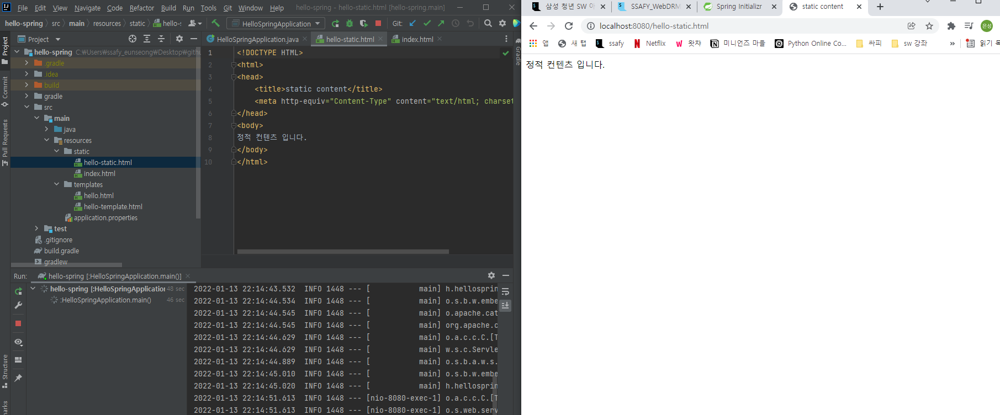
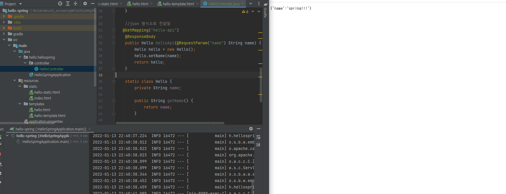

# 개발환경 설정(2022/01/10 ~ 2022/01/12)

## 기술스택 설정

- front : vue.js
- back : spring boot 2.5.8
  - Intellij 2021.3.1

### build test

### static contents

- http://localhost:8080/hello-static.html
- 스프링 부트의 내장 톰켓 서버가 요청을 받음
- 컨트롤러에 있는지 찾아봄
- static 컨트롤러가 없으면 resources: static/hello-static.html 을 찾음
- 웹에 반환 

- static/index.html 을 올려두면 Welcome page 기능을 제공

### MVC와 템플릿 엔진

- Model: 데이터
- view : 화면과 관련된 일만 처리
- controller: 비즈니스 로직, 데이터 처리 등

#### Thymeleaf 템플릿 엔진

- View Template Engine
  - 웹에서 정적 템플릿 파일을 사용할 수 있게 하는 것
  - 서버에서 HTML로 렌더링하기 전에 템플릿 파일로 변수를 전달하는 기능
- 태그의 속성으로 thymeleaf 명령어를 사용 가능

#### Intellij 단축키

- ctrl + p : 파라미터 요구사항 조희
- alt + insert : getter, setter 만들때 사용

- ctrl + shift + enter : 문장 말미에서 쳤을 때 세미콜론(;) 입력

### API

- json 형식으로 data 전달
- @ResponseBody
  - http응답에 그대로 데이터를 반환
  - 문자일 경우 : 문자 그대로
  - 객체일 경우 : HTTPMessageConverter 동작
    - JsonConverter 동작하고 Json형태로 반환

# 팀 병합 및 기획 수정(2022/01/13)

- 8팀: 채성원, 허영민 합류
- 기술스택 변경
  - front : react
  - back : spring boot
- 기획(아이디어 수정)
  - https://www.notion.so/a77c5dd7219144b88b7a64f43b3a7d18

